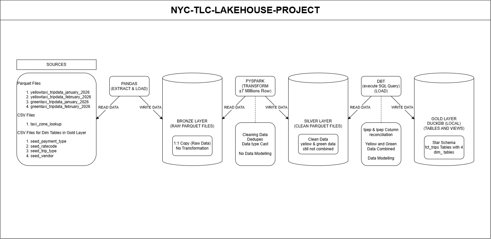
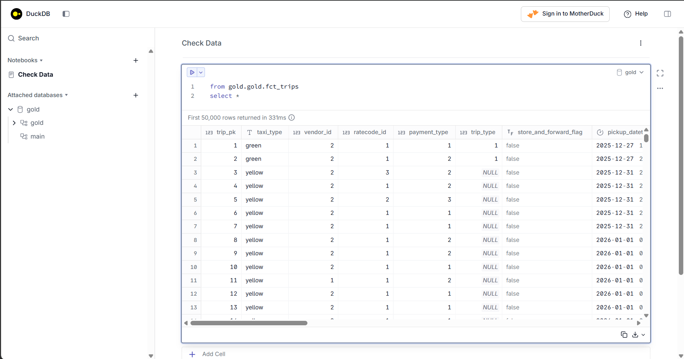

# NYC TLC Trip Data (2026) — PySpark + dbt Medallion Lakehouse

Portfolio project: Python + SQL + PySpark + dbt-duckdb, Bronze/Silver/Gold
medallion architecture. Ingestion and bronze->silver transformation are
hand-written and tested (see `ingestion/` and `transform/`); the gold layer
is a dbt project built on top of that silver output.

## Data
2 months each (Jan + Feb 2026) of NYC Yellow + Green taxi trip data (Parquet),
plus the taxi zone lookup table (CSV). Source:
https://www.nyc.gov/site/tlc/about/tlc-trip-record-data.page

Expected raw file layout (update `ingestion/bronze_confiq.py` if yours differs):
```
data/raw/yellow/yellow_tripdata_2026-01.parquet
data/raw/yellow/yellow_tripdata_2026-02.parquet
data/raw/green/green_tripdata_2026-01.parquet
data/raw/green/green_tripdata_2026-02.parquet
data/raw/taxi_zone_lookup.csv
```

## Architecture

```
data/raw/            <- downloaded source files
      |
      v  ingestion/raw_to_bronze.py  (pandas: land as-is, no transformation)
data/bronze/
      |
      v  transform/bronze_to_silver.py  (PySpark: clean, dedupe, readability
      |                                  renames, type casts. Yellow/Green
      |                                  stay separate, tpep_*/lpep_* kept
      |                                  as-is -- cross-source reconciliation
      |                                  is dbt's job, not silver's)
data/silver/
      |
      v  dbt_project/  (dbt-duckdb reads silver Parquet directly as sources)
gold schema (data/gold.duckdb)
```
**Query Sample**


See `docs/architecture.md` for the design reasoning (why PySpark, why the
clean-vs-reconcile split, why the fact table is normalized).

## How to run
**Option A — one command:**
```bash
python pipeline.py
```

**Option B — stage by stage (Mac/Linux/WSL, or Windows with `make` installed):**
```bash
make ingest
make silver
make gold
```

**Option C — manually, one stage at a time:**
```bash
cd ingestion && python raw_to_bronze.py && cd ..
cd transform && python bronze_to_silver.py && cd ..
cd dbt_project && dbt seed && dbt build && cd ..
```

First-time dbt setup: `cp dbt_project/profiles.yml.example ~/.dbt/profiles.yml`

## Tests
```bash
pytest tests/ -v
```

## Orchestration
`orchestration/dags/medallion_pipeline_dag.py` is a reference Airflow DAG --
not currently run (Airflow needs WSL2/Docker on Windows), but written and
ready for when that's set up. See the file's docstring for setup notes.

## TODOs (investigate and fixed data quality issue)
- Rows with trip_distance = 0 were investigated and found to co-occur with highly variable trip durations (from under a minute to over 12 hours) alongside non-zero fares — indicating GPS/meter distance-recording failures on otherwise real trips, not genuinely zero-distance rides. Affected ~3.45% of rows; filtered out in silver (trip_distance > 0).
- total_amount < 0 affected 1,122 rows (99% Cash payments). Unlike the Flex Fare zero-fare pattern, no legitimate business explanation was found — cash payments have no electronic reversal/refund mechanism, so a negative total doesn't correspond to a real financial event. Consistent with negative-value issues reported by other analysts of this dataset; treated as a data error and filtered.
- - Flex Fare trips (payment_type = 0) are E-Hail app trips with an agreed upfront price rather than a metered fare — the driver doesn't engage the meter, so fare_amount (a metered-fare field) shows as $0 even though the trip was real and the passenger paid through the app; keep the data in silver.
- passenger_count = 0 is a known, unresolved driver-reporting gap, and that any future analysis specifically about passenger counts (not present in current gold layer) should be aware of it; keep the data in silver.